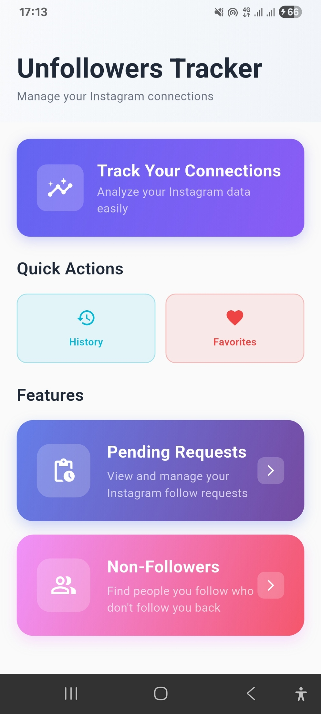
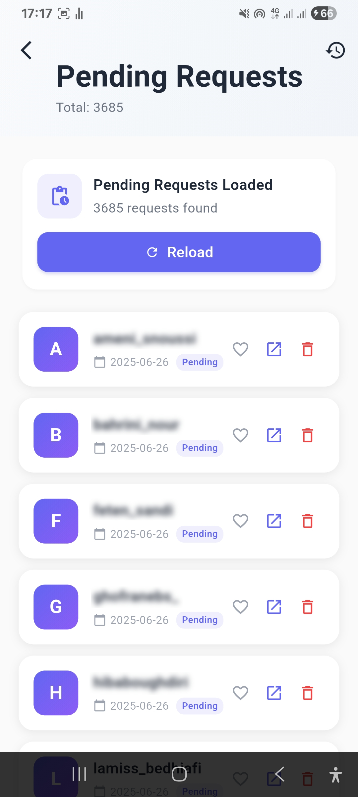
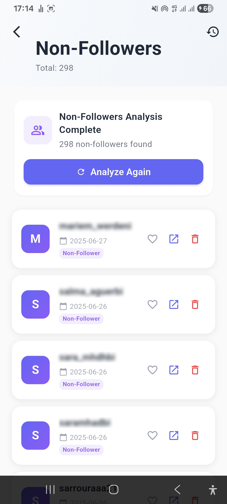
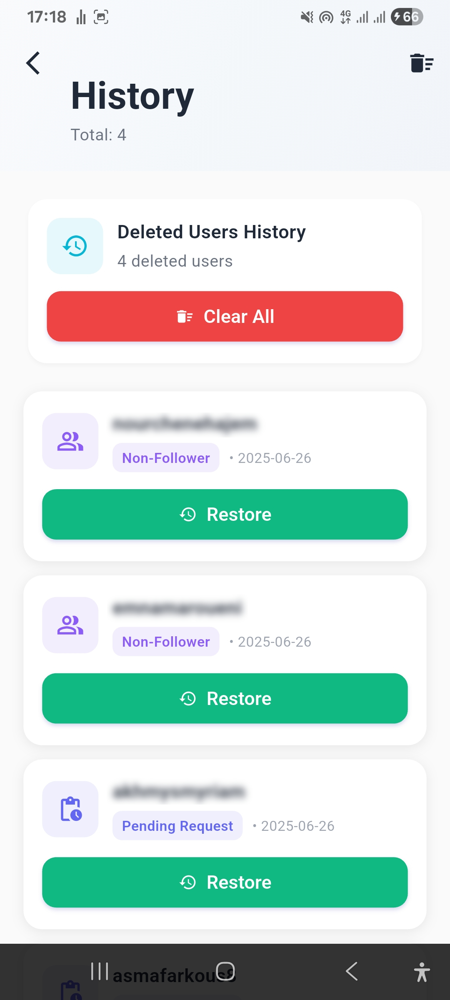
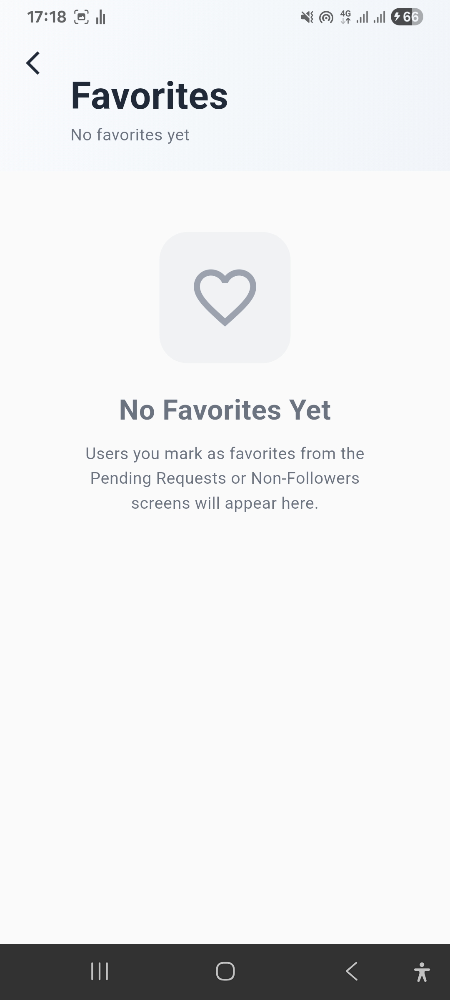

# InstaCheck �

[](https://flutter.dev/)
[](https://www.android.com/)

A powerful Android application for managing your Instagram connections, tracking unfollowers, and analyzing your followers' activity.

## ✨ Features

- 🔍 **Track Unfollowers**: Discover who unfollowed you on Instagram
- � **Non-Followers List**: See who doesn't follow you back
- ⏳ **Pending Requests**: Manage your pending follow requests
- ⭐ **Favorites**: Bookmark important accounts for quick access
- � **History**: Track changes in your followers over time
- 🎨 **Beautiful UI**: Clean and intuitive Material Design interface
- 🔒 **Local Storage**: Your data stays on your device

## 📱 Screenshots

| Home Screen | Pending Requests | Non-Followers | History | Favorites |
|-------------|------------------|---------------|---------|-----------|
|  |  |  |  |  |

## 🚀 Getting Started

### Prerequisites

- Flutter SDK (latest stable version)
- Android Studio (for Android development)
- VS Code or Android Studio with Flutter plugin

### Installation

1. **Clone the repository**
   ```bash
   git clone https://github.com/yassindaboussi/Unfollowers.git
   cd Unfollowers
   ```

2. **Install dependencies**
   ```bash
   flutter pub get
   ```

3. **Run the app on Android**
   ```bash
   flutter run -d android
   ```

## 🛠️ Built With

- [Flutter](https://flutter.dev/) - Beautiful native apps in record time
- [sqflite](https://pub.dev/packages/sqflite) - SQLite database for local storage
- [file_picker](https://pub.dev/packages/file_picker) - For selecting Instagram data files
- [url_launcher](https://pub.dev/packages/url_launcher) - For opening Instagram profiles
- [permission_handler](https://pub.dev/packages/permission_handler) - For managing app permissions

## 📝 License

[](LICENSE.md)

This project is licensed under the **View-Only License**. See the [LICENSE](LICENSE) file for details.

---

<div align="center">
  Made with ❤️ using Flutter
</div>